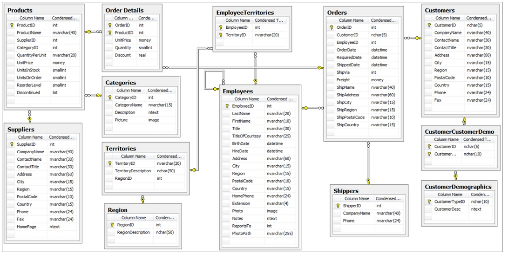
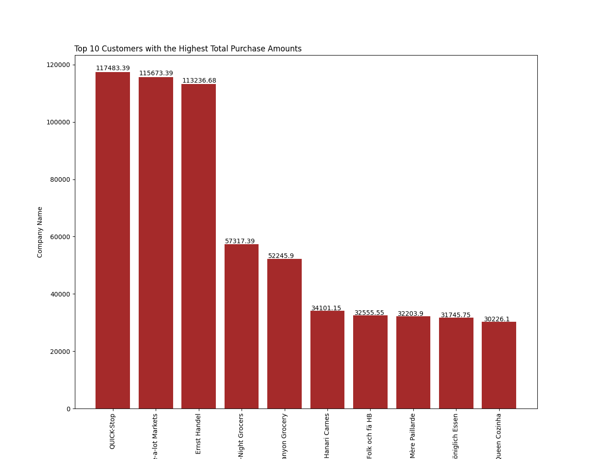
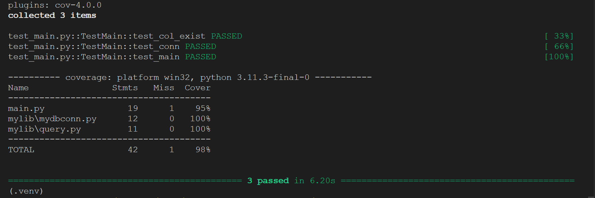

[][def]

# SQL Lab - Week 6 mini project

## The current implementation of the Mini-project can be executed as follows:

1. All dependencies needed for execution can be found in the [requirement.txt](https://github.com/nogibjj/oo46_Mini_Proj_W6/blob/main/requirements.txt) file.

2. The main purpose of this application is to [connect](https://github.com/nogibjj/oo46_Mini_Proj_W6/blob/main/mylib/mydbconn.py) to an Azure Sql Server database (online) and perform some [complex sql query](https://github.com/nogibjj/oo46_Mini_Proj_W6/blob/main/mylib/query.py).

   - The complex SQL query uses the Northwind sample database and retrieves the top N = 10 customers with the highest total purchase amounts. You can adjust the value of N as needed.
   - In this query:

     1. The RankedCustomers common table expression (CTE) calculates the total purchase amount for each customer by joining the Customers, Orders, and Order Details tables.

     2. It then assigns a rank to each customer based on their total purchase amount using the ROW_NUMBER() window function.

     3. The main query selects the top N customers with the highest total purchase amounts from the RankedCustomers CTE, where N is a parameter you can adjust.

     This query will give you a list of the top N customers with the highest total purchase amounts in the Northwind database, and it's applicable to databases with similar schema structure.

## Mini-project deliverables:

### Entity Relationship Diagram of Northwind Database:

### Application output:

### Testing outcome:

[def]: https://github.com/nogibjj/oo46_Mini_Proj_W6/actions/workflows/cicd.yml
